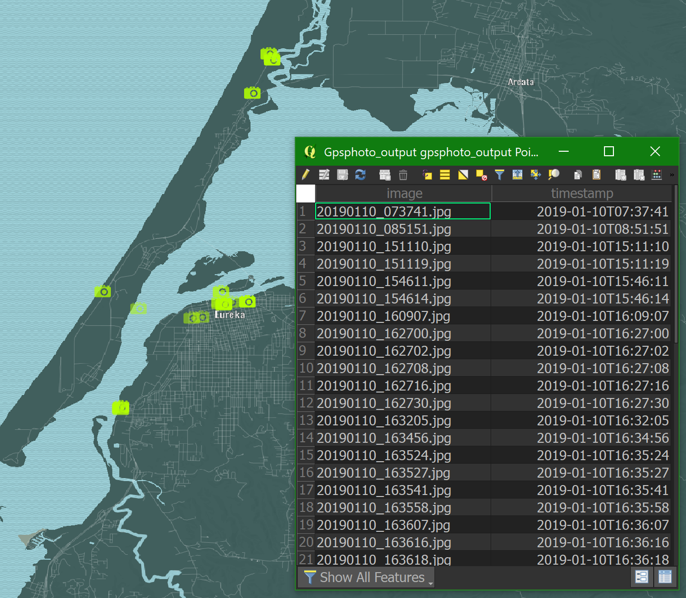

## Convert GPS-tagged photos to GeoJSON using Python and QGIS

### Dependencies

- [OSGeo4W](https://trac.osgeo.org/osgeo4w/) (QGIS)
  - Install `qgis-ltr` version from the Advanced Install options
  - Should be installed pre-loaded with Python 2.7 interpreter
- [PyCharm](https://www.jetbrains.com/pycharm/download/) (IDE)
  - Install the **Community Edition** so you don't have to purchase a license
- Python libraries
  - `os`: pre-installed
  - `csv`: pre-installed
  - `exifread`: pip install
  - `geojson`: pip install
  - `qgis`: pre-installed with OSGeo4W
- Batch file `pycharm-pygis.bat`
  - Must be run before main code to set-up system environment variables, path, etc.
  - This allows you to run QGIS commands inside PyCharm
  - **NOTE:** You may need to edit the text in this file to reflect your computer's local version of PyCharm, QGIS, and their paths, etc.

### Implementation

1. Clone [this repository](https://github.com/briangkatz/gps-photos-to-geojson/)
2. Run `pycharm-pyqis.bat`. PyCharm will open, aware of paths for QGIS and its Python library.
3. Ensure PyCharm interpreter settings are configured to the OSGeo4W `python.exe`
4. Move GPS-tagged photos into the `inputs` directory.
5. Run the `gps-photos-to-geojson.py` script.
6. Open the `outputs` folder to view resulting GeoJSON file, as well as intermediate CSV and JSON files.
7. Drag the GeoJSON file into a QGIS interface to see it mapped.
